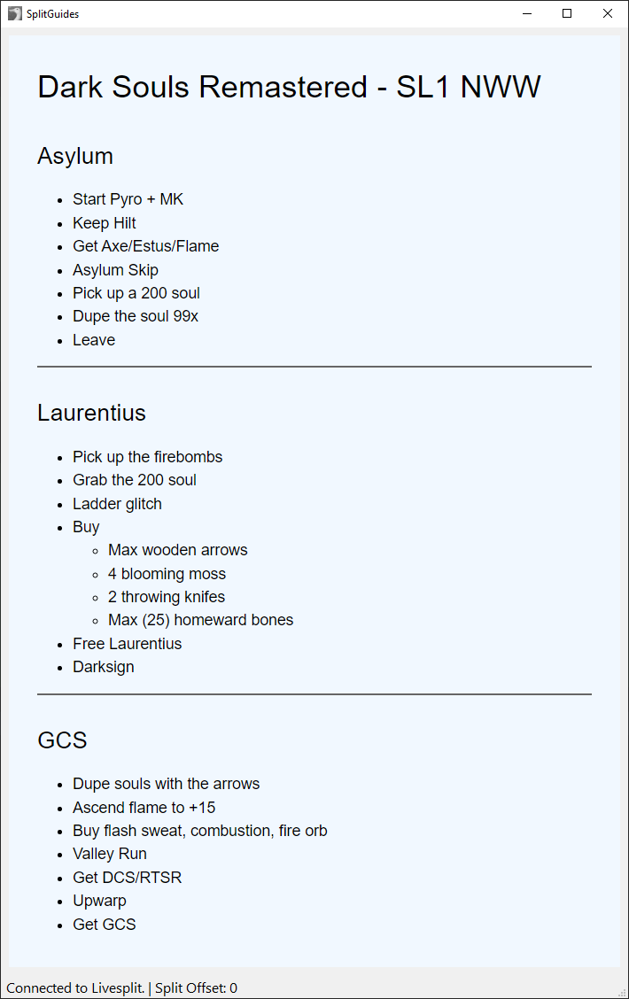
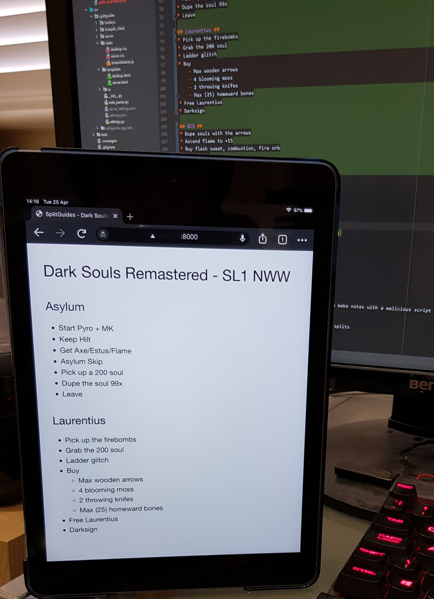

# SplitGuides #

**Speedrun notes display for Livesplit with markdown and html formatting**

SplitGuides is an application for displaying speedrun notes in sync with livesplit.
Requires *livesplit server* to be running.

Includes a server version for rendering notes in browsers on another device
(eg: tablet/phone).

## Install/Setup ##

### Standalone Bundle for Windows ###

1. Download `SplitGuides_v<VERSION>.zip` from the
   [**releases page**](https://github.com/DavidCEllis/SplitGuides/releases)
   Where `<VERSION>` is the version number of the release.
2. Extract anywhere and run *splitguides.exe*

### Using Python Packaging tools ###

#### UV ####

If you have [uv](https://docs.astral.sh/uv/) installed you can install and run splitguides
directly from the Python Package Index (PyPI).

* Install and run the latest release with `uvx splitguides`


## Usage ##

1. Connect with livesplit by starting the livesplit server component selecting
   'Control' and 'Start TCP Server' in livesplit.
2. Right click in the splitguides window and select 'Open Notes' and find the text file
   containing the notes you wish to use.
3. Some configuration is available from the settings dialog.

Plain text formatting works the same way as SplitNotes.
Notes made for that should function fine in SplitGuides.

Additionally Markdown and HTML formatted notes are supported.
These will be interpreted based on file extension (.md, .txt or .html).
Markdown and plain text formatted notes will automatically have line breaks
inserted in between lines.

1. Comment lines still use square brackets.
2. By default splits will break on newlines, multiple newlines are ignored in this case.
  * If a split separator is given, newlines are left as in the input to the
    markdown/html processors.

### If the notes are not advancing ###

If the text at the bottom says "Trying to connect to Livesplit." make sure that the TCP server
is running.

If that doesn't work, check in the Splitguides settings (from the right click menu)
* "Livesplit Server Hostname" should be `localhost`
* "Livesplit Server Port" should match the value for "Server Port" in Livesplit's own settings
  * This is `16834` by default

## SplitGuides Server ##

Included is a separate server version which launches a (local) webhost so you can view
the notes on another device on your local network.

Launch **splitguides_server.exe** to start the service. A settings dialog will appear
so you can customise this version separately from the desktop version. After asking
for the notes file the server will launch serving those notes and will update
automatically as you split.

If the hostname and port defaults aren't usable you can edit them
in the settings dialog.

This version is intended for people doing runs on a single monitor so the notes can be
displayed on another device (a tablet or phone for example). Just connect to the host
and port given in a web browser.

## Configuration ##

Configuration Options:

* Livesplit server hostname and port
* Display previous/next splits
* Split separator (leave blank for empty line separator)
* Font Size
* Text and Background Colour
* Alternative template HTML and CSS files
   * Jinja2 templating is used for the HTML, use the included file as a guide
   * Allows for further customising of the appearance if desired
* Hotkeys to offset the notes from the splits (not available in splitnotes server)
   * This allows for some adjustment if the notes have ended up in the wrong place
     relative to the splits.
* Server hostname and port (server only)
   * This should be your local machine name on the network and an open port to
     connect to from the device you wish to use to display the notes.

## Example Notes ##

### Source ###

```markdown
# Dark Souls Remastered - SL1 NWW #
## Asylum ##
* Start Pyro + MK
* Keep Hilt
* Get Axe/Estus/Flame
* Asylum Skip
* Pick up a 200 soul
* Dupe the soul 99x
* Leave

## Laurentius ##
* Pick up the firebombs
* Grab the 200 soul
* Ladder glitch
* Buy
   * Max wooden arrows
   * 4 blooming moss
   * 2 throwing knifes
   * Max (25) homeward bones
* Free Laurentius
* Darksign

## GCS ##
* Dupe souls with the arrows
* Ascend flame to +15
* Buy flash sweat, combustion, fire orb
* Valley Run
* Get DCS/RTSR
* Upwarp
* Get GCS
```

### Result ###

On Desktop:



Via Splitnotes Server on Tablet:



## Development ##

### Building the project environment ###

Once you have forked and cloned the repository the simplest way to setup the environment is to use
`uv`.

With the source folder as your current working directory:

```cmd
uv run pytest
uv run splitguides
```

Without `uv` you will need to manually set up and activate the python environment.

On Windows with the `py` command included with python.org installs:

```cmd
py -3.13 -m venv .venv
.venv\Scripts\activate
python -m pip install -e . --group dev
pytest
splitguides
```

## Contributions ##

* Transparent background support added by [@AlexKnauth](https://github.com/AlexKnauth)

## Dependencies ##
* pyside6 - QT Gui Bindings
* jinja2 - Templating for the notes page
* bleach - Cleaning HTML to help protect if someone decided to make notes with a malicious script
* flask - Handling the server version
* markdown - Converting markdown to html for rendering
* keyboard - Global hotkeys to advance/reverse note offset to splits
* waitress - wsgi server for splitguides server

---

Inspired by (but otherwise unassociated with) the original splitnotes:
https://github.com/joeloskarsson/SplitNotes
