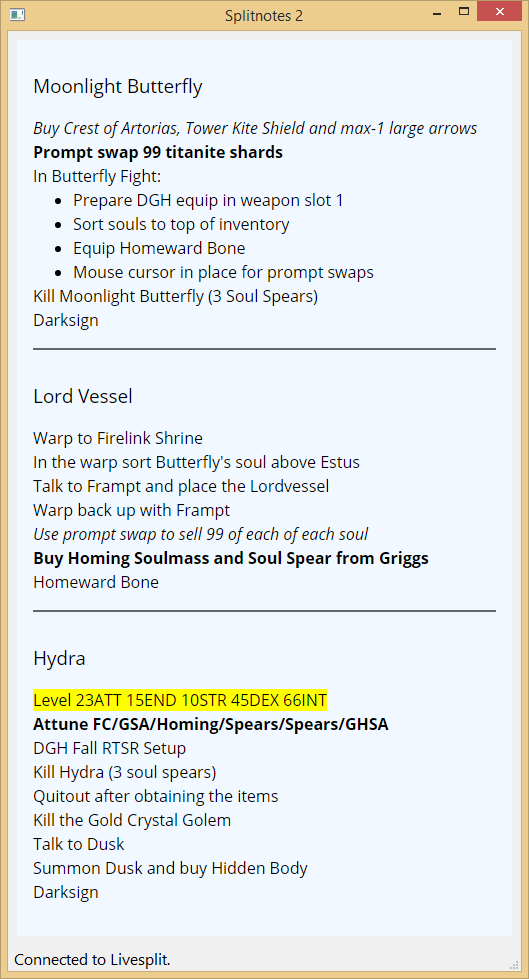

# Splitnotes 2 #

**Splitnotes but bigger***

Splitnotes2 is an application for displaying speedrun notes in sync with livesplit.
Requires *livesplit server* to be running.

## Install/Setup ##

1. Under the Livesplit layout editor add 'LiveSplit Server' (listed under 'control')
2. Download splitnotes2 from the [**releases page**](https://github.com/DavidCEllis/splitnotes2/releases)
3. Extract anywhere and run *splitnotes2.exe*

## Usage ##

1. Connect with livesplit by starting the livesplit server component selecting 
   'Control' and 'Start Server'
2. Right click in the splitnotes window and select 'Open Notes' and find the text file
   containing the notes you wish to use.
   
The formatting for notes basically follows the format used by the original SplitNotes 
with some additional enhancements and exceptions.

1. Comment lines still use square brackets.
2. By default the splits will break on newlines. Multiple newlines and comments are ignored.
3. The notes are now rendered as HTML and so can be formatted as such.

   This means that it's easy to emphasise important part of the notes using basic HTML tags such as
   `<strong>`, `<em>`, and `<mark>`.
   
   The formatter will automatically insert HTML breaks `<br>` between lines, 
   a backslash `\ ` at the end of a line will indicate that the line should
   have a break inserted (useful for headers and lists).
   
### Example Notes ###

#### Source ####

```html
<h3>Moonlight Butterfly</h3>\
<em>Buy Crest of Artorias, Tower Kite Shield and max-1 large arrows</em>
<strong>Prompt swap 99 titanite shards</strong>
In Butterfly Fight:\
<ul>\
  <li>Prepare DGH equip in weapon slot 1</li>\
  <li>Sort souls to top of inventory</li>\
  <li>Equip Homeward Bone</li>\
  <li>Mouse cursor in place for prompt swaps</li>\
</ul>\
Kill Moonlight Butterfly (3 Soul Spears)
Darksign

<h3>Lord Vessel</h3>\
Warp to Firelink Shrine
In the warp sort Butterfly's soul above Estus
Talk to Frampt and place the Lordvessel
Warp back up with Frampt
<em>Use prompt swap to sell 99 of each of each soul</em>
<strong>Buy Homing Soulmass and Soul Spear from Griggs</strong>
Homeward Bone

<h3>Hydra</h3>\
<mark>Level 23ATT 15END 10STR 45DEX 66INT</mark>
<strong>Attune FC/GSA/Homing/Spears/Spears/GHSA</strong>
DGH Fall RTSR Setup
Kill Hydra (3 soul spears)
Quitout after obtaining the items
Kill the Gold Crystal Golem
Talk to Dusk
Summon Dusk and buy Hidden Body
Darksign
```

#### Result ####



   

Inspired by the original splitnotes: https://github.com/joeloskarsson/SplitNotes

[*] approximately 19x larger in file size (PySide2 is large)
