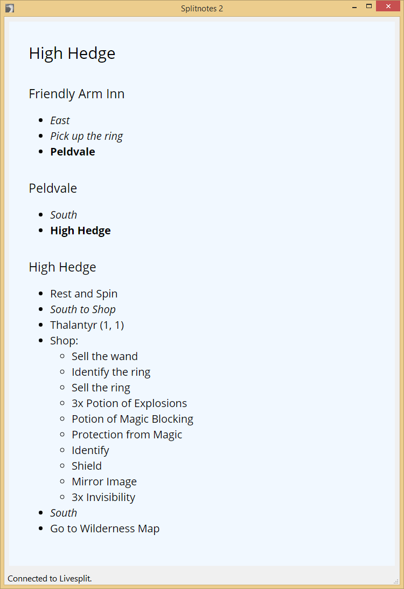

# SplitGuides #

**Speedrun notes display for Livesplit with markdown and html formatting**

SplitGuides is an application for displaying speedrun notes in sync with livesplit.
Requires *livesplit server* to be running.

Includes a server version for rendering notes in browsers on another device 
(eg: tablet/phone).

## Install/Setup ##

1. Under the Livesplit layout editor add 'LiveSplit Server' (listed under 'control')
2. Download SplitGuides from the [**releases page**](https://github.com/DavidCEllis/SplitGuides/releases)
3. Extract anywhere and run *splitguides.exe*

## Usage ##

1. Connect with livesplit by starting the livesplit server component selecting 
   'Control' and 'Start Server'
2. Right click in the splitguides window and select 'Open Notes' and find the text file
   containing the notes you wish to use.
   
Plain text formatting works the same way as SplitNotes. 
Notes made for that should function fine in SplitGuides. 

Additionally Markdown and HTML formatted notes are supported.
These will be interpreted based on file extension (.md, .txt or .html).
Markdown and plain text formatted notes will automatically have line breaks 
inserted in between lines.

1. Comment lines still use square brackets.
2. By default splits will break on newlines, multiple newlines are ignored in this case.
3. The rendering is done as HTML so HTML formatting can be used.
   
## splitguides_server.exe ##

Now included is a server version which launches a (local) webhost so you can view the notes
on another device on your local network. Launch splitguides_server.exe to start the service.

If the hostname and port defaults aren't usable you can set them by editing server_hostname 
and server_port in settings.json. There is no dialog for editing these settings yet.
   
### Example Notes ###

#### Source ####

```markdown
## High Hedge ##
### Friendly Arm Inn ###
* *East*
* *Pick up the ring*
* **Peldvale**

### Peldvale ###
* *South*
* **High Hedge**

### High Hedge ###
* Rest and Spin
* *South to Shop*
* Thalantyr (1, 1)
* Shop:
    * Sell the wand
    * Identify the ring
    * Sell the ring
    * 3x Potion of Explosions
    * Potion of Magic Blocking
    * Protection from Magic
    * Identify
    * Shield
    * Mirror Image
    * 3x Invisibility
* *South*
* Go to Wilderness Map
/split
```

#### Result ####



## Configuration ##

The settings page offers some customisation and connection settings including:

  * Server hostname and port
  * Show previous/next N splits
  * Custom split separator
  * Base font size
  * Default text and background colour
  * HTML (Jinja2) template and CSS files to use for rendering

## Dependencies ##
* pyside2 - QT Gui Bindings
* jinja2 - Templating for the notes page
* bleach - Cleaning HTML to help protect if someone decided to make notes with a malicious script
* flask - Handling the server version
* markdown - Converting markdown to html for rendering
* keyboard - Global hotkeys to advance/reverse note offset to splits

--- 

Inspired by (but otherwise unassociated with) the original splitnotes: https://github.com/joeloskarsson/SplitNotes
